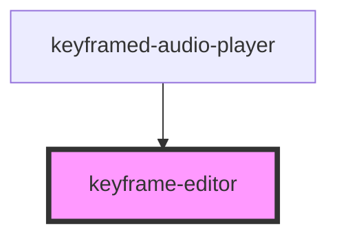

# keyframe-editor

<!-- Auto Generated Below -->

## Properties

| Property | Attribute | Description | Type      | Default     |
| -------- | --------- | ----------- | --------- | ----------- |
| `open`   | `open`    |             | `boolean` | `undefined` |

## Methods

### `getHeightPercentage(widthPercentage: number) => Promise<number>`

#### Returns

Type: `Promise<number>`

## Dependencies

### Used by

 - [keyframed-audio-player](..\keyframed-audio-player)

### Graph

----------------------------------------------

*Built with [StencilJS](https://stenciljs.com/)*
