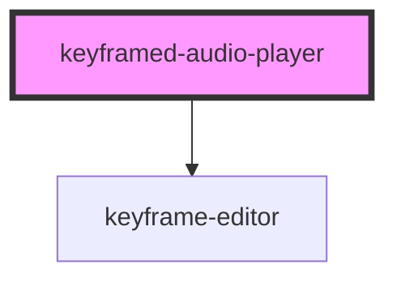

# my-component

This is the keyframed-audio-player master component. It contains a separate AudioContainer class to handle the non-visual calculations.

<!-- Auto Generated Below -->

## Properties

| Property | Attribute | Description | Type     | Default     |
| -------- | --------- | ----------- | -------- | ----------- |
| `name`   | `name`    |             | `string` | `undefined` |
| `url`    | `url`     |             | `string` | `undefined` |

## Dependencies

### Depends on

- [keyframe-editor](../keyframe-editior)

### Graph

----------------------------------------------

*Built with [StencilJS](https://stenciljs.com/)*
